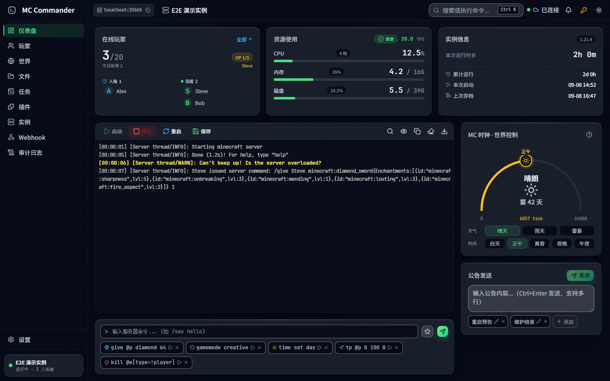
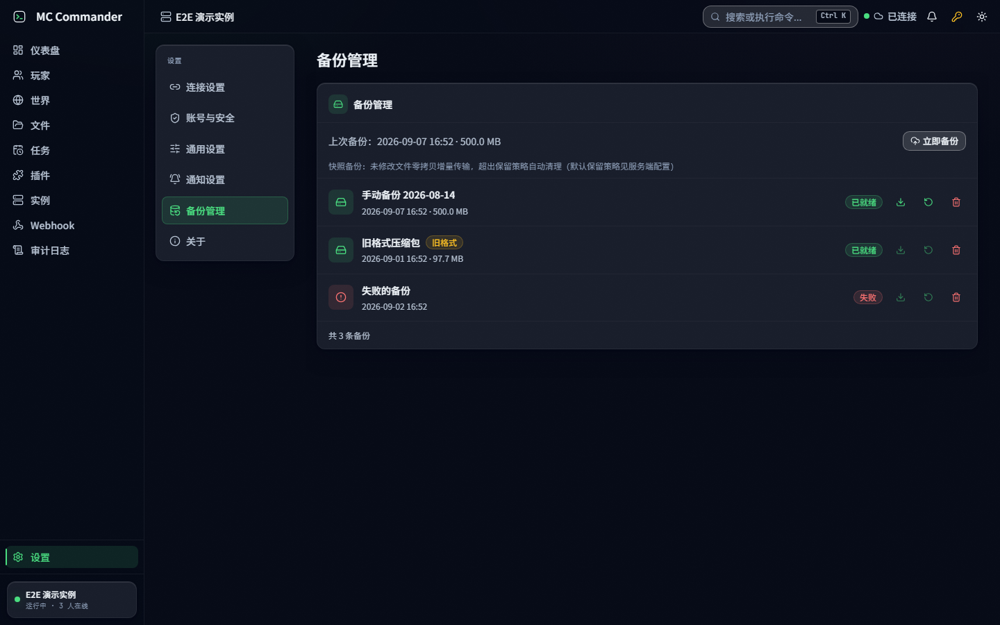
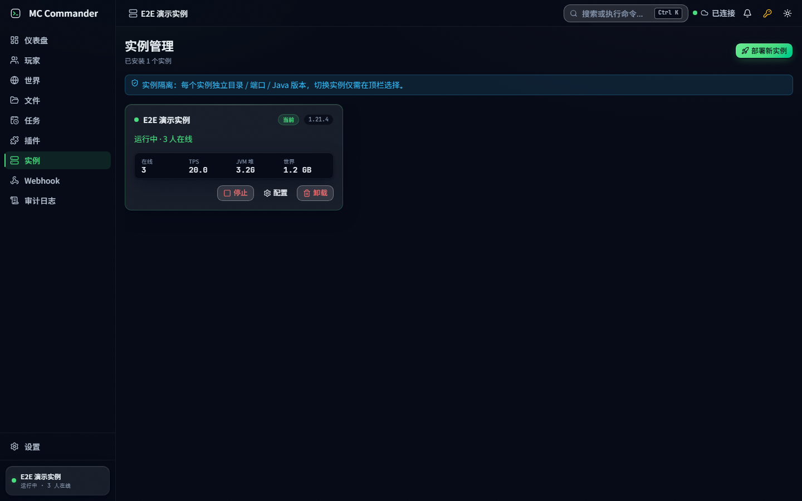
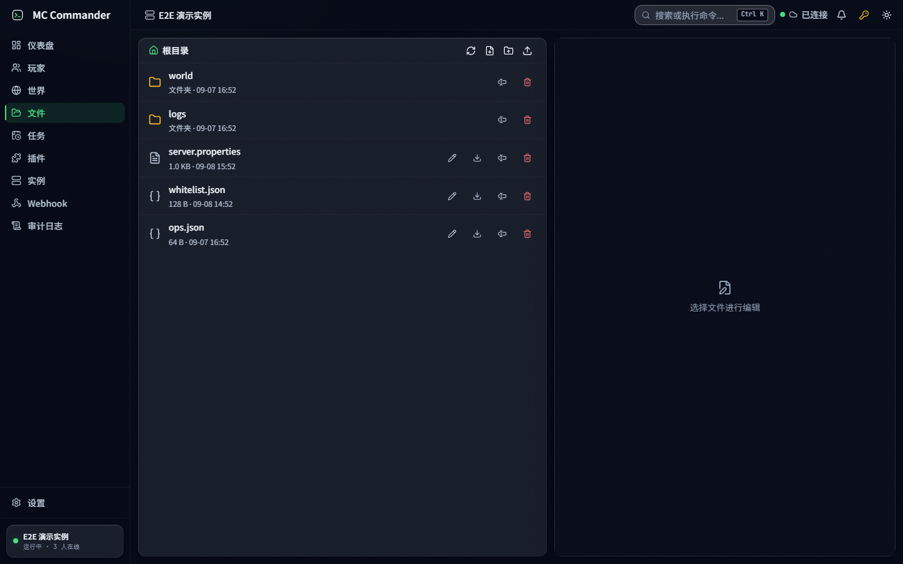
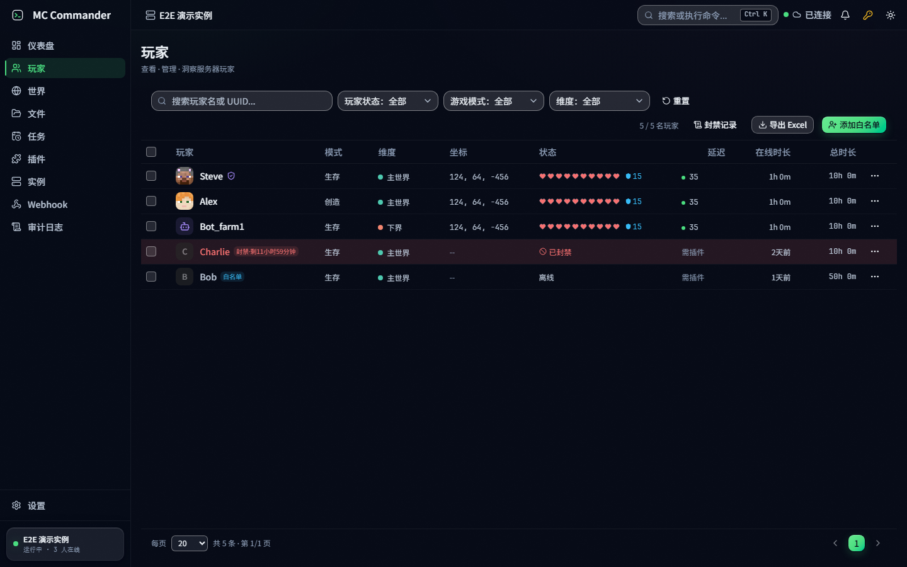

<p align="center">
  
   <!-- x-release-please-version -->
  
</p>

<h1 align="center">MC_Commander</h1>
<p align="center">自托管 Minecraft 服务器管理面板 — 图形化免命令管理你的 MC 服务器（预览版）</p>

MC_Commander 是一个自托管的 Minecraft 服务器管理工具。**核心定位：图形化界面拼装指令，服主无需手敲任何 MC 命令**——可视化给予物品（含附魔/药水）、传送、封禁、踢出等操作全部由面板自动生成指令。架构为 **Web 前端（React 19）+ Node.js 服务端（Express + WebSocket + better-sqlite3）**，浏览器直接访问即用。愿景：覆盖 MC 服务器全生命周期——建服、运营、扩展、排障、迁移——以友好直观的界面与交互，打造高效、省心、值得信赖的服务器控制面板。国内用户可访问 gitee 镜像仓库（`https://gitee.com/wyyfzb/mc-commander`，分支/标签自动同步，Release 附件不随镜像）。

---

## 截图

> 以下截图为示例环境（虚构数据）渲染效果，实际面板展示你的服务器真实状态。

| 仪表盘 |
|---|
|  |

| 备份管理 | 实例列表 |
|---|---|
|  |  |

| 文件管理 | 玩家管理 |
|---|---|
|  |  |

> 其余页面（世界/任务/插件/Webhook/审计/设置）截图待补充；完整操作流程见 [docs/user-guide.md](docs/user-guide.md)。

---

## 功能特性

### 玩家管理（免命令图形化）
- **可视化给予物品** — 200 余种物品 9 大分类 + 40 余种附魔（按物品过滤、冲突禁用）+ 20 余种药水（3 种瓶型/等级/时长）+ 6 套预设礼包（可自定义增删）；命令按 MC 版本三格式自适应（1.21.2+/26.x、1.20.5-1.21.1、≤1.20.4），附命令预览与复制
- **可视化传送** — 传送到玩家 / 坐标表单（默认填当前位置）/ 世界出生点 / 个人复活点 / 主世界原点 / 自定义快捷点（持久化），支持修改世界出生点
- **封禁/解封** — 玩家/IP 双类型、6 档时长（1 小时~永久，**临时封禁服务端自实现**，不依赖插件）、9 个预设理由+自定义、可附加踢出；封禁记录弹窗与详情区块（30 秒自动刷新）
- **批量操作** — 批量传送/给予/白名单/OP/清空背包/切换模式/踢出，自动跳过离线玩家
- 踢出、OP/取消 OP、白名单增删（离线玩家也有效）、切换游戏模式、清空背包、治疗/喂饱（效果命令封装）、私聊、玩家详情 5-Tab 浮层（概览/物品栏/传送/给予物品/日志）、**Excel 导出**

### 世界与服务器
- **server.properties 全表单化** — 80 余个已知属性（玩法/世界生成/服务器设置三大类）可视化编辑，**未知属性自动追加**（自动识别布尔/数值），保存提示需重启项，热改属性服务端自动转命令即时生效
- **游戏规则** — 全量 gamerule 查询/行级编辑，命令输出双版本解析（MC 26.x 与旧版）
- **仪表盘** — 实时状态卡片、MC 时钟、日志流、**公告发送**（say/tellraw 自动转义）、**天气/时间分段按钮**（乐观更新）、快捷命令 chips（持久化）、命令自动补全（50 余条 12 分类）、EULA 引导、断线重连 Banner
- **定时任务** — 重启/备份/执行命令/停止/启动 5 种类型，cron **可视化编辑器**（分/时/日/月/周）+ 8 个预设模板，立即执行，最近运行状态回显
- **文件管理** — 在线浏览/编辑，Monaco 全屏编辑器（语法高亮/行号/多步撤销重做/Ctrl+S/CRLF 保真/脏标记拦截），删除确认

### 部署与运维
- **进程级异常兜底** — 未捕获异常/拒绝（uncaughtException/unhandledRejection）记录结构化错误日志（含堆栈）后自动优雅停机（停实例落盘、关库），避免无日志静默崩溃导致所有实例托管断连
- **一键部署** — Vanilla/Paper/Fabric/Forge/Purpur 五种服务端类型，自动下载 JAR（实时进度）、Java 版本检测、首次启动配置、失败可重试
- **Aikar's Flags JVM 优化** — 一键生成 G1GC 优化参数集，内存滑块带推荐值
- **备份管理** — **目录快照 + 增量传输**（Linux rsync `--link-dest` 硬链接快照：未变化文件零拷贝；Windows rsync 优先、自动降级 robocopy 全量镜像）、**实例级备份**（世界+配置+插件全量，自动排除日志/加载器依赖/jar，兼容 26.x 新布局与旧版 Bukkit 维度目录）、在线备份原子序列（save-off→save-all flush→save-on）、恢复异步化（后台执行 + 进度事件 + 自动回滚 + 快照预检 + level.dat 完整性校验）、**自动清理**（数量/天数双上限）、磁盘预检与快照完整性校验（SQLite 持久化；旧 zip 备份保留可删、恢复拒绝）、**面板自身数据快照**（SQLite 在线备份 API 每日快照至 `backups/panel/`，保留策略与实例备份一致，恢复步骤见服务端 README 备份章节；`.env` 不入自动备份，手动备份在服务端 README 有指引）
- **性能监控** — CPU/内存/TPS 采集，WebSocket 实时推送

### 实时与可靠性
- **WebSocket 实时推送**（30 余种事件）— 日志流、状态、玩家加入/离开/死亡/复活/成就/聊天/入睡、TPS/性能、天气、玩家状态（血量/坐标）、备份/恢复进度（含恢复异步化三事件与跳过提示）、部署/升级进度、系统资源统计
- **通知事件落库 + 断线补齐** — 通知类事件广播前持久化，客户端重连携带 lastEventId 重放断线期间事件（重启不丢近期事件）
- **WebSocket 优先 + HTTP 保底轮询** — WS 断开自动降级轮询（间隔可配置）；心跳保活（30s ping）清理死连接，广播背压保护防慢客户端拖垮内存
- **通知系统** — 游戏事件/管理命令/服务器告警（severity 分级：崩溃/备份失败→error、资源告警→warning），Toast（时长分级/底部堆叠/图标/动画规范化）+ 系统通知，逐项可配开关；去重组合键（类型+实体）聚合计数 ×N 防刷屏；**通知中心交互闭环**（未读/已读/清除/角标）；历史持久化重启不丢；备份失败全程可见（含定时备份 setup 阶段）；批量死亡事件 5s 窗口聚合（团灭只广播一条）
- **Webhook 国内渠道预设** — 飞书/钉钉/企微/Server酱/PushPlus 五渠道开箱即用，按各平台官方协议自动构造签名与消息体（飞书 body 内加签、钉钉 URL 参数加签），表单 URL/密钥字段随渠道联动，服务器事件可推送到手机 IM

## 快速开始

### 服务端部署

需要 **Node.js 22+** 和 **Java 17/21/25**（部署脚本会自动安装）。双包 package.json 均已声明 `engines`（node>=22）并启用 engine-strict，低版本 Node 执行 `npm install` 会直接报错拒绝安装，避免装完依赖运行时才崩溃。

#### 方式一：Linux 一键部署（推荐）

```bash
curl -fsSL -o /tmp/deploy-mc-commander.sh https://raw.githubusercontent.com/wyyfzb/mc-commander/main/mc_commander_server/scripts/deploy-mc-commander.sh
sudo bash /tmp/deploy-mc-commander.sh
```

脚本会自动安装 Java/Node.js、下载代码、生成 API Key 与一次性 SETUP_TOKEN 并注册 systemd 服务（下载
tarball 带 sha256 完整性校验）。
**SETUP_TOKEN 仅首次设密使用**：公网部署时，浏览器首访设密页需粘贴部署输出中的 SETUP_TOKEN
（防部署完成到设密窗口内被抢先接管面板，一次性，用后作废）。
（国内网络可改用 gitee 镜像源（分支为 `main`，无 `master`）：`https://gitee.com/wyyfzb/mc-commander/raw/main/...` 同路径，并配合 `PACKAGE_URL`/`PACKAGE_SHA256` 环境变量）

#### 方式二：手动部署

```bash
git clone https://github.com/wyyfzb/mc-commander.git
cd mc-commander/mc_commander_server

npm install
cp .env.example .env   # 编辑 .env，设置 API Key（两种部署口径见下）

# （可选）同源托管 Web 前端：public/index.html 存在时服务端自动托管前端
# （含 SPA 深链接兜底），目录可用 PUBLIC_DIR 覆盖；不做这一步则只跑后端 API
(cd ../mc_manager_web && npm install && npm run build)
mkdir -p public
cp -r ../mc_manager_web/dist/. public/

npm start
```

**API Key 部署口径（二选一）**：
- **明文自动迁移（推荐）**：`.env` 中设置 `API_KEY=<你的密钥>`，首次启动自动计算 SHA-256 并改写为 `API_KEY_HASH=<sha256hex>` 哈希存储，明文行随即移除（迁移失败时日志提示手动替换）；生产环境（`NODE_ENV=production`）下弱密钥（长度 <16 或纯重复字符）阻断启动，`ALLOW_WEAK_KEY=1` 可临时豁免（仅限开发联调，严禁生产开启）。
- **纯 HASH 零明文落盘**：直接写入 `API_KEY_HASH=<sha256hex>`（如 `printf '%s' '你的密钥' | sha256sum` 生成），不配置明文 `API_KEY`。

启动校验以 `API_KEY_HASH` 为准：两种方式最终都未设置（或迁移失败）时，服务端打印错误横幅并以 `exit(1)` 拒绝启动。

服务端默认运行在 `http://localhost:25566`

### Web 前端运行

需要 **Node.js 22+**（`npm install` 受 engines 门禁强制校验，低版本 Node 直接报错拒绝安装）。

```bash
cd mc_manager_web
npm install

npm run dev      # 开发运行（默认 http://localhost:5173，代理指向 25566）
npm run build    # 生产构建（tsc -b + vite build）
npm run preview  # 预览生产构建
```

首次打开引导页按向导设置管理员密码（如服务端配置了 `SETUP_TOKEN`，按提示输入）即可使用。

### HTTPS 反向代理（Nginx / Caddy）

面板自身只监听 HTTP（默认 25566），生产环境建议置于反向代理之后终止 TLS——PWA 安装、
剪贴板等浏览器能力要求安全上下文（HTTPS 或 localhost），公网纯 HTTP 部署会缺失这些能力。

**Nginx**（`/ws` 必须单独声明 upgrade 头，否则 WebSocket 握手失败）：

```nginx
server {
    listen 443 ssl;
    server_name mc.example.com;
    ssl_certificate     /etc/letsencrypt/live/mc.example.com/fullchain.pem;
    ssl_certificate_key /etc/letsencrypt/live/mc.example.com/privkey.pem;

    location /ws {
        proxy_pass http://127.0.0.1:25566;
        proxy_http_version 1.1;
        proxy_set_header Upgrade $http_upgrade;
        proxy_set_header Connection "upgrade";
        proxy_read_timeout 3600s;
        proxy_set_header Host $host;
        proxy_set_header X-Forwarded-For $proxy_add_x_forwarded_for;
    }

    location / {
        proxy_pass http://127.0.0.1:25566;
        proxy_set_header Host $host;
        proxy_set_header X-Forwarded-For $proxy_add_x_forwarded_for;
        proxy_set_header X-Forwarded-Proto $scheme;
    }
}
```

**Caddy v2**（自动申请证书，WebSocket 升级开箱可用）：

```caddyfile
mc.example.com {
    reverse_proxy 127.0.0.1:25566
}
```

- 前端产物放进 `public/` 后与 API 同源托管在 25566，故**只需代理一个端口**。
- `TRUST_PROXY`（默认 `1`）对应单层反代；多级代理（CDN + Nginx 等）按层数调大，设 `0`
  则忽略转发头。该值只影响 `req.ip` 解析；**登录失败锁定键始终取直连 IP**（反代后即代理
  自身地址），故建议在代理层再加一层登录限流。

## 创建 MC 实例

### 方式一：面板一键部署（推荐）

在"创建实例"页面，选择服务端类型（Vanilla/Paper/Fabric/Forge/Purpur）、MC 版本、实例名称和内存，点击部署即可。系统会自动：

1. 调用对应 API 获取最新版本（minecraft-core + Paper v3 API）
2. 下载 JAR 文件（got.stream 带进度反馈，WebSocket 推送部署进度）
3. 自动检测并选择合适的 Java 版本（参考 HeadlessMC 版本矩阵）
4. 生成 server.properties、eula.txt 等配置文件
5. 执行首次启动生成完整配置
6. 写入 SQLite 数据库并加载到管理面板

### 方式二：手动创建

在 `servers/` 目录下创建子目录，包含 `instance.json`：

```json
{
  "id": "my-server",
  "name": "My Server",
  "jarFile": "server.jar",
  "maxMemory": "4G",
  "minMemory": "2G"
}
```

然后将 `server.jar` 放入同一目录。服务端启动时自动迁移到 SQLite 数据库。

## 系统架构

```
┌─────────────────────────────────────────────────────────────┐
│                     Web 前端（浏览器）                        │
│        React 19 + TS + Vite + Tailwind v4 + shadcn/ui       │
│  ┌──────────┐ ┌──────────┐ ┌──────────┐ ┌──────────────┐   │
│  │ 仪表盘    │ │ 玩家管理  │ │ 世界管理  │ │ 文件/任务/实例│   │
│  └────┬─────┘ └────┬─────┘ └────┬─────┘ └──────┬───────┘   │
│       │             │            │               │          │
│  ┌────┴─────────────┴────────────┴───────────────┴──────┐   │
│  │        zustand + TanStack Query + WebSocket 层        │   │
│  └────────────────────────┬──────────────────────────────┘   │
└───────────────────────────┼──────────────────────────────────┘
                            │
                  HTTP API + WebSocket
                    (API Key 鉴权)
                            │
┌───────────────────────────┼──────────────────────────────────┐
│  ┌────────────────────────┴──────────────────────────────┐   │
│  │              Node.js 后端 (Express + ws)                │   │
│  │  ┌────────┐ ┌──────────┐ ┌────────┐ ┌──────────────┐ │   │
│  │  │ 路由层  │ │ 中间件层  │ │ 服务层  │ │ 数据库/WS    │ │   │
│  │  └────────┘ └──────────┘ └────────┘ └──────────────┘ │   │
│  └────────────────────────┬──────────────────────────────┘   │
│                           │ RCON (TCP)                       │
│  ┌────────────────────────┴──────────────────────────────┐   │
│  │              Minecraft Java Server                      │   │
│  │              (Vanilla / Paper / Fabric / Forge / Purpur)│  │
│  └───────────────────────────────────────────────────────┘   │
└───────────────────────────────────────────────────────────────┘
```

### 通信方式

| 方式 | 用途 | 频率 |
|------|------|------|
| **HTTP REST API** | 实例管理、玩家操作、文件操作 | 按需调用 |
| **WebSocket** | 日志流、状态推送、玩家事件、性能数据 | 实时推送 |
| **HTTP 保底轮询** | WebSocket 断开时的后备机制 | 可配置（默认 30s） |
| **RCON (TCP)** | 向 MC 服务器发送命令、查询数据 | 串行队列 |

### WebSocket 接入

```javascript
// 连接（通过 Subprotocol 鉴权）
const ws = new WebSocket('ws://host:25566/ws', ['mc-commander-apikey.YOUR_KEY']);

// 订阅实例（携带 lastEventId 可断线补齐：服务端重放其后遗漏的通知事件）
ws.send(JSON.stringify({ type: 'subscribe', instanceId: 'my-server', lastEventId: 42 }));

// 接收事件（通知类事件携带自增 id 字段，客户端记录以用于断线补齐）
ws.onmessage = (event) => {
  const { id, type, data } = JSON.parse(event.data);
  // type: log / status / playerJoin / playerLeave / playerDeath / achievement / ...
};
```

支持 **30 余种事件类型**，按域分组：日志/状态（`log`、`status`、`performanceUpdate`、`weatherUpdate`、`systemStatsUpdate`）、玩家（`playerJoin`、`playerLeave`、`playerDeath`、`playerRespawn`、`playerChat`、`playerSleep`、`achievement`、`playerStatsUpdate`）、备份/恢复（`backupStart`、`backupComplete`、`backupFailed`、`backupSkipped`、`restoreStart`、`restoreComplete`、`restoreFailed`）、任务/部署/升级（`taskExecute`、`taskFailed`、`deployProgress`、`deployComplete`、`deployFailed`、`upgradeProgress`、`upgradeComplete`、`upgradeFailed`）、可靠性（`webhookDeliveryFailed`、`circuit_breaker`、`error`）。完整清单以 [`websocket.js`](mc_commander_server/websocket.js) 的 `WSEvents` 枚举为单一事实源。

> `tpsUpdate` 已并入 `performanceUpdate`（payload 含 tps 字段，避免双广播冗余）；`playerDeath` 批量场景为聚合格式 `{players: [...], count: N}`（5s 窗口）；`deployProgress` 进度节流 ≥1% 才发射。

> **连接上限**：服务端最多同时接受 **32 个 WebSocket 连接**（`MAX_CONNECTIONS`），超过上限的新连接将被拒绝；单个连接最多订阅 64 个实例、每分钟 60 条消息（防滥用保护）。

## Web 页面一览

| 页面 | 功能 |
|------|------|
| **引导页** | 服务器连接配置（三种部署引导 + 手动配置）、API Key 校验、明文连接警告 |
| **仪表盘** | 状态卡片、MC 时钟、实时日志流、公告/天气/时间按钮、快捷命令、命令补全、通知面板 |
| **玩家管理** | 玩家列表（筛选/排序/分页）、批量操作栏、玩家详情 5-Tab 浮层（概览/物品栏/传送/给予物品/日志）、封禁记录、Excel 导出 |
| **世界管理** | 世界信息、维度概览、server.properties 全表单（66 已知 + 未知自动追加，编辑守卫 + 30s 自动刷新）、游戏规则 |
| **文件管理** | 三栏文件浏览、全屏编辑器（Monaco：语法高亮/撤销重做/Ctrl+S/CRLF 保真）、删除 |
| **定时任务** | Cron 任务管理（5 类型 + 可视化编辑器 + 预设模板 + 立即执行 + 上次运行状态） |
| **实例管理** | 一键部署（5 服务端类型/版本/内存）、实例卡片（切换/启动配置/卸载） |
| **设置** | 连接配置、通用设置（自动重启等）、通知开关（22 类型两组）、备份管理、关于 |

## 环境变量

| 变量 | 默认值 | 说明 |
|------|--------|------|
| `API_KEY` | （与 `API_KEY_HASH` 二选一） | API 认证密钥（明文）：首次启动自动迁移为 `API_KEY_HASH` 哈希存储并移除明文行；生产环境弱密钥（长度 <16 或纯重复字符）阻断启动（`ALLOW_WEAK_KEY` 可临时豁免，严禁生产开启） |
| `API_KEY_HASH` | （与 `API_KEY` 二选一，启动校验以本值为准） | API 认证密钥的 SHA-256 哈希（零明文落盘口径，如 `printf '%s' '<密钥>' \| sha256sum` 生成）；最终都未设置时启动报错 `exit(1)` |
| `SETUP_TOKEN` | （未配置） | 首访设密所有权证明（一次性）：配置后 `POST /auth/setup` 必须携带 `Authorization: SetupToken <token>`，校验通过立即作废（内存 + 本行移除）；部署脚本首次部署自动生成，未配置 = 不校验（仅建议本机/可信网络使用） |
| `HOST` | `127.0.0.1` | 服务监听地址：公网部署需显式设 `0.0.0.0`（默认仅本机） |
| `TRUST_PROXY` | `1` | 信任反向代理层数（Express trust proxy）：默认 1 兼容 nginx/CDN 反代，设 0 不信任代理头（`req.ip` = 直连 IP）；仅影响 `req.ip` 解析，登录锁定键始终取直连 IP |
| `PORT` | `25566` | 服务端口 |
| `SERVERS_DIR` | `./servers` | MC 实例数据目录 |
| `DATA_DIR` | `./data` | SQLite 数据库目录 |
| `BACKUPS_DIR` | `./backups` | 备份存储目录 |
| `PUBLIC_DIR` | `./public` | 前端静态产物目录（锚定服务端安装目录而非工作目录，一般无需修改） |
| `BODY_LIMIT_JSON` | `1mb` | 认证前 JSON body 大小上限（body-parser limit 语法）；文件上传走 multipart 独立通道不受此值影响 |
| `BACKUP_RETENTION_MAX` | `10` | 每实例保留备份数量上限（超出自动清理） |
| `BACKUP_RETENTION_DAYS` | `30` | 备份最大保留天数（超出自动清理） |
| `PANEL_BACKUP_ENABLED` | `true` | 面板自身数据每日快照开关（SQLite 在线快照至 `backups/panel/`） |
| `PANEL_BACKUP_CRON` | `0 4 * * *` | 面板快照 cron 表达式 |
| `PANEL_BACKUP_RETENTION_MAX` / `PANEL_BACKUP_RETENTION_DAYS` | 继承 `BACKUP_RETENTION_*` | 面板快照独立保留策略（数量/天数上限） |
| `BACKUP_SPAWN_TIMEOUT_MS` | `3600000` | 备份/恢复子进程超时上限（默认按规模动态计算） |
| `BACKUP_IN_PROGRESS_TIMEOUT_MS` | `3600000` | 进行中备份/恢复记录卡死判定阈值（崩溃后自动重置） |
| `LOG_LEVEL` | `info` | 日志级别 (debug/info/warn/error) |
| `ADMIN_SESSION_TTL_HOURS` | `168` | 管理员会话滑动有效期（小时）：每次认证触达续期，续期上限受 `ADMIN_SESSION_ABSOLUTE_TTL_DAYS` 约束 |
| `ADMIN_SESSION_ABSOLUTE_TTL_DAYS` | `30` | 会话绝对存活期（天）：自创建起超过即强制重登（限制被窃取令牌的永久有效窗口）；设 0 关闭（不建议） |
| `ADMIN_SESSION_MAX_SESSIONS` | `5` | 每用户会话并发上限：新登录挤掉最旧会话 |
| `AUTH_LOGIN_MAX_FAILS` | `10` | 登录失败锁定阈值（按账号/来源 IP 内存级计数，重启即清零） |
| `AUTH_LOGIN_LOCK_MS` | `300000` | 登录失败锁定时长（毫秒） |
| `RATE_LIMIT_WINDOW` | `60000` | 速率限制窗口（毫秒） |
| `RATE_LIMIT_MAX` | `240` | 窗口内最大请求数（认证前按 IP 计数；默认兼顾前端多标签页轮询 ≈72-96 req/min 不误伤） |
| `CRASH_LOOP_WINDOW_MS` | `300000` | 崩溃循环熔断滑动窗口（毫秒） |
| `CRASH_LOOP_MAX_CRASHES` | `5` | 窗口内连续崩溃次数阈值：达到即自动禁用该实例 autoRestart |
| `AUTO_START_DELAY_MS` | `3000` | 面板重启后自动恢复实例的间隔（毫秒） |
| `DISK_WARNING_PERCENT` | `85` | 磁盘使用率告警阈值（百分比，warning 级通知） |
| `DISK_ERROR_PERCENT` | `95` | 磁盘使用率告警阈值（百分比，error 级通知） |

## 技术栈

| 组件 | 技术 |
|------|------|
| 前端框架 | React 19 + TypeScript（strict）+ Vite |
| UI | Tailwind CSS v4 + shadcn/ui（Radix） |
| 状态管理 | zustand（含 persist）+ TanStack Query（服务端状态） |
| 路由 | react-router |
| 数据表格 | TanStack Table + Virtual |
| 代码编辑器 | Monaco Editor |
| 终端 | xterm.js |
| 测试 | Vitest + Testing Library（单测）、Playwright（e2e）、MSW（mock） |
| 后端框架 | Express.js (ESM) |
| 数据库 | SQLite (better-sqlite3) |
| 实时通信 | ws (WebSocket) |
| HTTP 客户端 | got（服务端 JAR 下载、API 调用） |
| MC 服务端下载 | minecraft-core（Vanilla/Fabric/Forge/Purpur）+ Paper v3 API 自适应 |
| Java 版本检测 | 自建版本矩阵（参考 HeadlessMC） |
| RCON 协议 | rcon-client（零依赖、Promise API、串行队列） |
| 定时任务 | croner（零依赖、DST 感知） |

## 项目结构

```
mc-commander/
├── mc_manager_web/            # Web 前端
│   ├── src/
│   │   ├── main.tsx       # 入口（QueryClient + Tooltip + Router + Toaster）
│   │   ├── routes.tsx     # 路由表（react-router v8 data mode）
│   │   ├── features/      # 功能域（dashboard/players/world/files/tasks/instances/settings/onboarding/emergency）
│   │   ├── components/    # 通用组件 + mcs/ 设计系统组件
│   │   ├── stores/        # zustand store（连接/通知偏好/部署）
│   │   ├── api/           # REST/WS 客户端 + 类型契约
│   │   ├── lib/           # 领域逻辑（mc-items/mc-properties/mc-gamerules/mc-cron 等）
│   │   ├── hooks/         # 自定义 hooks（use-unsaved-guard 等）
│   │   └── styles/        # 设计系统 token（--mcs-* 唯一来源）
│   ├── e2e/               # Playwright E2E（mock 数据）
│   └── scripts/           # mock-server（E2E 数据源）
├── mc_commander_server/      # Node.js 后端
│   ├── index.js          # 入口 (Express + WebSocketServer)
│   ├── config.js         # 配置加载 (.env)
│   ├── websocket.js      # WebSocket 事件广播（30 余种事件；通知落库/断线补齐/心跳/背压）
│   ├── routes/           # API 路由（status/players/backups/tasks/files/server-jar/keys）
│   ├── services/         # 业务逻辑（mc_server/backup/task_scheduler）
│   ├── middleware/       # 中间件（auth/cors/error_handler/rate_limit）
│   ├── db/               # SQLite 模型（instance/backup/scheduled_task/ban）
│   └── utils/            # 工具（response/java-detector/player-utils）
├── docs/                     # 架构说明 / 用户指南 / 产品截图
├── .github/                  # CI 工作流 / Issue 与 PR 模板 / Dependabot
├── AGENTS.md                 # AI 编码工具上手指南（人类贡献者同样适用）
└── scripts/                  # 通用脚本（local-check 一键本地检查）
```

## 环境要求

| 依赖 | 版本要求 |
|------|---------|
| Node.js | 22+ |
| Java | 17/21/25（部署脚本自动安装，按 MC 版本自动选择） |
| 浏览器 | 现代浏览器（Chrome/Edge/Firefox） |
| 操作系统 | 服务端: Linux / Windows / macOS；前端构建: 任意 |

## 平台支持

| 平台 | 支持状态 |
|------|---------|
| Linux | ✅ 全支持（推荐部署环境，一键部署脚本面向 Ubuntu/Debian） |
| Windows | ⚠️ 实验性——官方部署脚本与发布包面向 Linux，Windows 需按「手动部署」自行构建前端产物并装依赖（better-sqlite3 13.x 已随包提供 win32 预编译产物，无需本机构建工具链）；建议使用 WSL2 以获得与 Linux 一致体验 |
| macOS | ✅ 支持（同 Windows：官方发布包面向 Linux，需自行构建前端产物；better-sqlite3 13.x 已随包提供 macOS 预编译产物） |

> 部署脚本（`方式一：Linux 一键部署`）仅面向 Linux；Windows / macOS 请走手动部署路径。

## 开发与测试

```bash
# 服务端（vitest，1700+ 用例）
cd mc_commander_server
npm install
npm run dev        # 热重载开发
npm test

# Web 前端
cd mc_manager_web
npm install
npm run dev        # 开发（默认 5173，代理指向 25566）

# 前端单测（vitest，1400+ 用例）/ 类型检查 / lint / 生产构建
npm test
npx tsc -b --noEmit
npm run lint
npm run build

# E2E（自动起 mock 服务 + dev server；12 spec）
npm run test:e2e
```

### CI 与本地检查

PR 会自动跑 GitHub Actions（lint / typecheck / 单测 / e2e / 密钥扫描，见 `.github/workflows/ci.yml`）。
本地一键执行等价检查：

```bash
# 契约包 + 服务端 + 前端：lint / 类型检查 / 单测 / 设计与对比度守门（Git Bash / Linux / macOS）
bash scripts/local-check.sh

# 仅服务端（前端依赖未安装时适用）
bash scripts/local-check.sh --skip-frontend

# 跳过契约包（未改动 mc-schemas 时可省一步）
bash scripts/local-check.sh --skip-schemas
```

详细贡献流程见 [CONTRIBUTING.md](CONTRIBUTING.md)。

## 常见问题

### 连接失败
- 检查服务端是否运行：`curl http://localhost:25566/health`（无需鉴权）
- 检查 API 是否可访问：`curl -H "X-API-Key: YOUR_KEY" http://localhost:25566/api/v1/overview`
- 检查防火墙是否开放端口（默认 25566）
- 检查引导页填写的 `apiKey` 是否正确

### MC 服务器启动失败
- 检查 Java 是否安装：`java -version`
- 检查 `server.jar` 是否存在于实例目录
- 查看服务端日志输出

### 统计信息不更新
- 本项目的游戏时长由服务端自行追踪（不依赖 MC 的 `world/stats/` 文件），玩家进服游玩后离开即会记录

## License

[AGPL-3.0](LICENSE)（GNU Affero General Public License v3.0）

通过本项目建设修改版并提供网络服务时，同样需要以 AGPL-3.0 开源你的修改。

## 参与贡献

- 贡献流程与开发环境：[CONTRIBUTING.md](CONTRIBUTING.md)
- 安全问题报告：[SECURITY.md](SECURITY.md)
- 行为准则：[CODE_OF_CONDUCT.md](CODE_OF_CONDUCT.md)
- 架构与设计决策：[docs/](docs/)

---

> 项目最初为自用开发的 Minecraft 服务器管理面板，现已开源。如有问题或建议，欢迎提交 Issue 或参与讨论。
